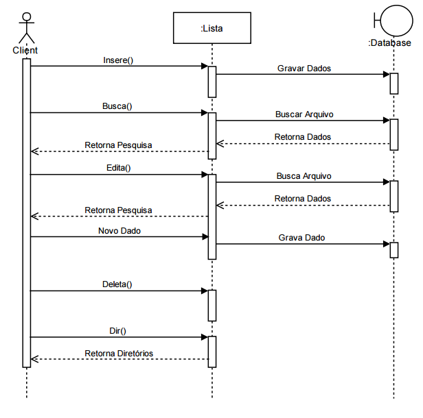
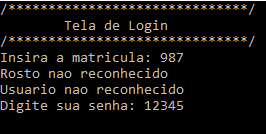
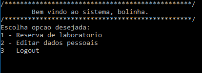
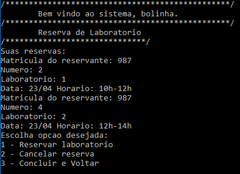

# projetoTP1_2

## Introdução
Projeto final disciplina Técnicas de Programação 1 

Este projeto consiste em um sistema de controle de acesso para ser utilizado na entrada dos Laboratórios de Informática (Linf). 

Sendo que no momento do cadastramento de usuário são passados suas informações e logo após o sistema capta algumas fotos do rosto dessa pessoa com diferentes expressões faciais para que seja feita a validação de acesso.

O reconhecimento facial é uma das técnicas mais utilizadas na biometria tanto para a segurança da informação como para segurança de nossa sociedade. 

Este trabalho implementa um software que reconhece uma imagem retirada através de um webcam ou câmera para reconhecer suas características e compará-las com as de um banco de dados. 

Foi utilizada a biblioteca OpenCV, biblioteca para a utilização de processamento de imagens de grande eficácia e por obter excelentes resultados no reconhecimento de características utilizando os HaarCascade. O software foi
desenvolvido em c++.

## Requisitos Linux:

Versão testada Ubuntu 16.04 LTS

> Compilador :

g++ (Ubuntu 5.4.0-6ubuntu1~16.04.4) 5.4.0 20160609

Copyright (C) 2015 Free Software Foundation, Inc.

> Opencv 3.2.0-dev:

Fonte: https://github.com/opencv/opencv

Modulos extra: https://github.com/opencv/opencv_contrib

<h2>Requisitos Windows</h2>

> Compilador G++

Baixe o MinGW acessando <a href="https://sourceforge.net/projects/mingw-w64/">SourceForge</a>, clique depois em Download e espere o download finalizar, execute o aplicativo. Prossiga com Next e escolha a configuração adequada, como uma versão mais recente e a arquitetura compatível. Clique em Next até finalizar a instalação. Será mostrado uma tela inicial mostrando informações do Projeto. Prossiga até chegar em uma tela para escolher os recursos que serão instalados, selecione mingw32-base e o mingw32-gcc-g++. Depois disso, clique em Instalattion > Apply Changes.

Agora será necessário adicionar o diretório de binários do MinGW na Path do Windows, para isso, clique no Iniciar, e depois clique com o botão direito em Computador, e em seguida em Propriedades. No lado esquerdo clique em Configurações avançadas do sistema. Clique agora em variáveis de ambiente. Ache a variável PATH, e clique em editar, no fim dela, adicione um “;” (ponto e vírgula), e coloque o diretório dos binários que foram instalados com o MinGW (geralmente em C:\Program Files (x86)\mingw-w64). Para testar se deu certo, abra o Prompt de Comando e digite “g++”.

> .NET Framework

Será utilizado nas próximas instalações o .NET Framework. Baixe acessando <a href="https://www.microsoft.com/net/download/framework">Microsoft</a>, escolha uma versão 4.3 ou superior e clique em Download. Execute e aceite os termos de contrato e em seguida clique em instalar, espere o download e a instalação finalizar.

> OpenCV

Baixe o <a href="http://opencv.org/releases.html">OpenCV</a> versão 2.4.* de preferência ou acesse diretamente pela página do <a href="https://sourceforge.net/projects/opencvlibrary/files/opencv-win/2.4.11/opencv-2.4.11.exe/download">SourceForge</a> que irá fazer o Download automaticamente. Depois abra e clique em extrair.

Agora será necessário adicionar o diretório de binários do OpenCV na Path do Windows, para isso, clique no Iniciar, e depois clique com o botão direito em Computador, e em seguida em Propriedades. No lado esquerdo clique em Configurações avançadas do sistema. Clique agora em variáveis de ambiente. Em variáveis do sistema clique em Novo, defina o nome da variável como "OPENCV_DIR" sem aspas e o valor da variável como o diretório da build do OpenCV (ex. C:\opencv\build;). Ache a variável PATH, e clique em editar, no fim dela, adicione um “;” (ponto e vírgula), e coloque "%OPENCV_DIR%" ligado a continuação do diretório dos binários que foram instalados com o OpenCV (ex. %OPENCV_DIR%\x64\vc11\bin;).

> Visual Studio IDE

Para quem gosta do auxílio que uma IDE proporciona, sugiro baixar o <a href="https://www.visualstudio.com/pt-br/vs/cplusplus/?rr=https%3A%2F%2Fwww.google.com.br%2F">VisualStudio</a>.

Veja aqui um <a href="http://www2.ic.uff.br/~crisnv/disciplinas/procImg/Tutorial_de_Instal_do_OpenCV.pdf">tutorial</a> instrutivo que irá deixar a IDE configurada para reconhecer a biblioteca OpenCV.

<h2>Build e Compilation</h2>

Baixe o <a href="https://cmake.org/download/">CMake</a> para a portabilidade do seu projeto após verificar o tipo de sistema de sua máquina e extraia os arquivos. Após a extração encontre o diretório binário do CMake e execute o programa cmake-gui. Após isso insira o caminho dos arquivos de código na primeira entrada e na segunda insira o caminho que irá ser armazenados os arquivos build do CMake. Clique em Configure e depois que nenhum erro for relatado, você pode clicar no botão Generate. E seu trabalho estará pronto.

CMakeLists:

<pre>cmake_minimum_required (VERSION 2.6)<br>project (tp1.2)<br>add_executable(tp1.2 tp1.cpp)</pre>

Linha de comando utilizada:

<pre>cmake .</pre>

## Documentação
A documentação foi gerada utilizando a ferramenta Doxygen, podendo ser acessada pelo link:
https://mashiro11.github.io/solucaoCpp/projetoFinalTP1/html/

## Diagrama Casos de uso

Esse diagrama foi feito pensando nos principais atores presentes no laboratório.
É também uma ideia inicial de modelagem do banco de dados.


Fonte:

https://yuml.me/diagram/scruffy/usecase/samples

```
[Professor]-(Reservar laboratório)
[Professor]-(Acessar laboratório)
[Professor]-(Criar cadastro de acesso)
[Aluno]-(Criar cadastro de acesso)
[Aluno]-(Acessar laboratório)
[Funcionário]-(Criar cadastro de acesso)
[Funcionário]-(Acessar laboratório)
[Funcionário]-(Modificar cadastro de acesso)
[Funcionário]-(Excluir cadastro de acesso)
```

## Diagrama de Atividades

Descreve o parte do sistema de reconhecimento de faces para permitir a entrada ou cadastrar uma pessoa no linf.


Fonte:

https://yuml.me/diagram/nofunky/activity/samples

```
(start)->(Reconhecer_Face)-><a>[Ok]->(Permite_Acesso_Linf),
<a>[Nao_identificado]->(Digita_login_senha)->(Atualiza_Cadastro)->(Permite_Acesso_Linf)->(end)
```

##  Diagram de Sequência

Primeiro diagrama de sequência 


Fonte:

https://www.websequencediagrams.com/

```
title Sistema Trabalho 2
User->SGBD: informar número de matrícula
alt Matrícula encontrada
    SGBD->SYSTEM: retorna fotos do User
    User->SYSTEM: captura uma foto
    SYSTEM->User: reconhece foto
    alt foto Não reconhecida
        User->SYSTEM: captura foto
        SYSTEM->SGBD: armazena nova foto
    end
else Matrícula não encontrada
    SGBD->User: cadastrar_User()
    User->SGBD: informa dados()
    User->SYSTEM: captura fotos()
    SYSTEM->SGBD: armazena fotos()
end
SYSTEM->User: Validar User
```

##  Diagrama de Classes

Primeiro diagrama de classes


<h2>Diagrama de Sequência</h2>



<h2>Screenshots</h2>






